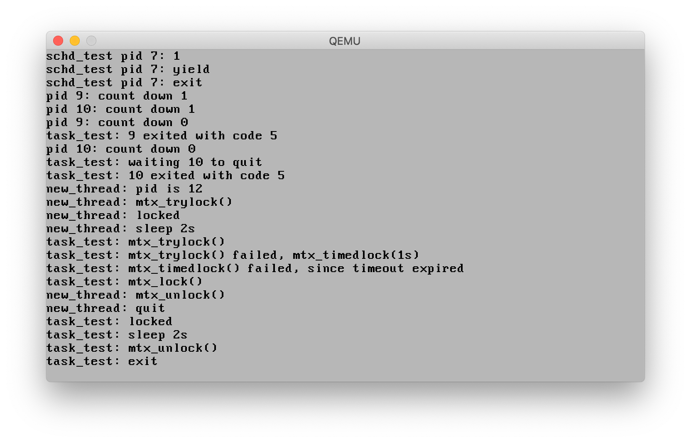

# nonoOS
我的第一个操作系统。
  
此操作系统由自制的 bootloader 引导，目前已经实现一个操作系统的最小功能，包括中断处理、标准输入输出、动态内存分配、虚拟内存、用户态空间、抢占式调度、进程隔离、进程/线程间通信、进程/线程间同步。
  
接下来将实现硬盘接口(尽量 VMA 和 PIO 都提供吧)、swap、图形界面(目前想模仿一个老 Mac OS X 的 Aqua 风格出来)、TCP/IP 网络栈、SMP 支持（支持对称多处理器，这个要实现正确还是很难的）。
  
目前还只在模拟器中运行过，不过要支持在物理机上跑应该也没有什么工作量。

<h2>进展</h2>

| 功能 | 状态 | 分支 |
| ------- | ------ | ------ |
|引导器(Bootloader)|OK|master|
|中断处理(Interrupt)|OK|interrupt|
|显卡和键盘驱动|OK|drivers|
|页式内存分配|OK|memory|
|malloc|OK|memory|
|虚拟内存|OK|memory|
|task(进程/线程)|OK|master|
|上下文切换|OK|task|
|task调度|OK|master|
|系统调用|OK|master|
|同步原语|OK|master|
|硬盘接口|PENDING|-|
|换页|PENDING|-|
|图形界面|PENDING |-|
|TCP/IP|PENDING|-|
|SMP支持|PENDING|-|

<h2>编译</h2>

目前不提供环境搭建和编译方法。如果竟然真的有人想在他的机器上编译和运行这程序，请给我来信。 我的邮箱是liuziangexit@gmail.com

<h2>nono没有被抛弃！</h2>

由于个人安排，在接下来半年中，此项目的开发工作将暂停。但今宵离别后，我一定会回来的！
