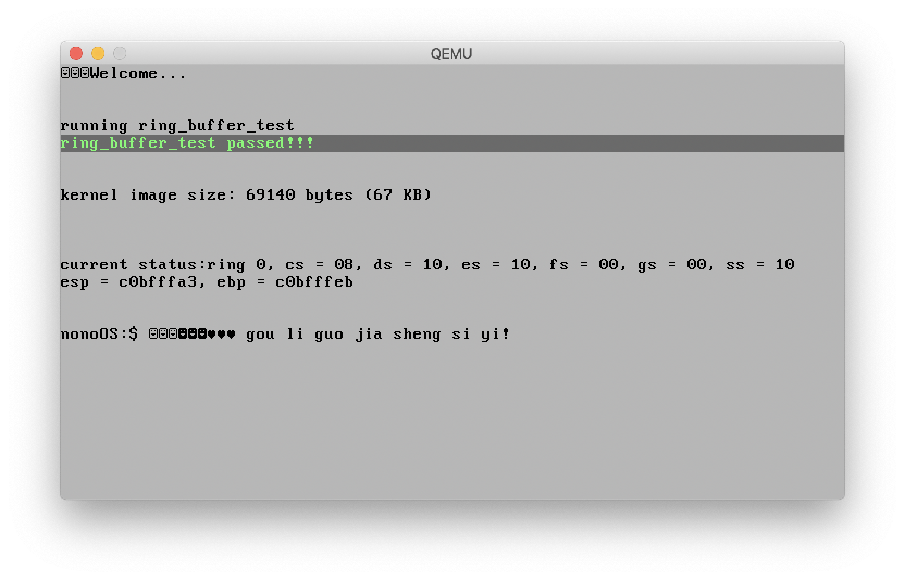

# nonoOS
我的第一个操作系统。



<h2>进展</h2>

| 功能 | 状态 | 分支 |
| ------- | ------ | ------ |
|引导器(Bootloader)|OK|master|
|中断处理(Interrupt)|OK|interrupt|
|显卡和键盘驱动|OK|drivers|
|页式内存分配|OK|memory|
|malloc|OK|memory|
|虚拟内存|WORKING|memory|
|task(进程/线程)|WORKING|-|
|上下文切换|WORKING|-|
|task调度|WORKING|-|
|系统调用|WORKING|-|
|硬盘接口|PENDING|-|
|换页|PENDING|-|
|同步原语|PENDING|-|
|SMP支持|PENDING|-|
|图形界面|PENDING |-|
|POSIX Socket接口|PENDING|-|

<h2>编译并运行！</h2>
前置需求:
<br>
- 面向386或686的gcc和binutils
<br>
- make
<br>
- 面向386或686的qemu
<br><br>
编译运行:

```
tools/run.sh
```

编译:

```
tools/build.sh
```

调试:

```
tools/debug.sh
```
